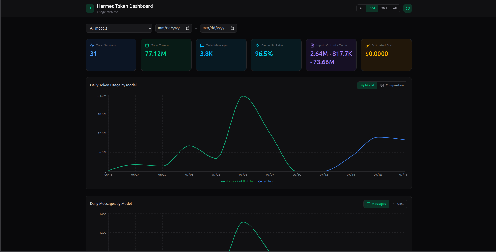
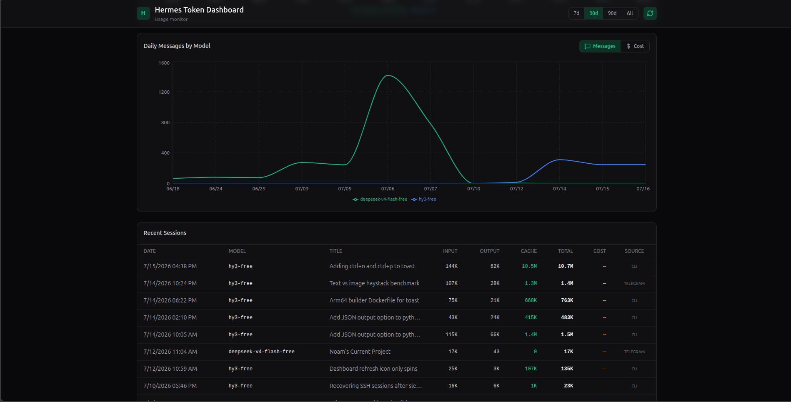

# Hermes Token Dashboard

A self-contained dashboard for monitoring [Hermes](https://hermes-agent.nousresearch.com) agent token and cost usage. It reads the host's Hermes `state.db` (the session/usage log) in **read-only** mode and serves a React single-page app plus a small FastAPI backend from a single container on port `8100`.

## Features

- **Summary cards** — total sessions, total tokens, total messages, cache-hit ratio, input/output/cache split, and estimated cost for the active range.
- **Daily token usage by model** — stacked-per-model line chart (or a stacked *composition* area chart showing input / output / cache read breakdown).
- **Daily messages & cost by model** — switchable secondary chart.
- **Recent sessions table** — paginated list with date, model, title, input/output/cache/total tokens, cost (✓ marks rows with an actual instead of estimated cost), and the session source.
- **Filtering** — time presets (7d / 30d / 90d / All), a model dropdown, and a custom date-range picker via the filter bar.
- **Auto-refresh** — polls every 30s (toggleable); the refresh icon spins only while a refresh is in flight.
- **Read-only** — opens `state.db` with `mode=ro`; the dashboard never writes to the host database.

## Screenshots




## Layout

```
backend/      FastAPI app (also serves the built SPA from /app/static)
frontend/     React + Vite + Recharts SPA (Tailwind v4)
Dockerfile    multi-stage build (node build -> python serve)
compose.yaml  one-service stack, mounts host state.db read-only, behind Traefik
.dockerignore
build.sh      convenience wrapper: `docker build -t hermes-token-dashboard .`
start.sh      local dev launcher (backend :8100 + vite :8080)
```

## Run with Docker Compose

```bash
# default: mounts ~/.hermes (contains state.db) read-only
docker compose up -d --build

# or point at a different Hermes data dir
HERMES_HOST_DIR=/srv/hermes/data docker compose up -d --build
```

Open http://localhost:8100

> Requires the `docker compose` v2 plugin. On hosts with only the v1 binary,
> use `docker-compose up -d --build` (the same file works for both).

The compose file is wired for a Traefik reverse proxy (`traefik` external
network) and expects `APP` / `DOMAIN` environment variables to set the
published hostname. To run standalone without Traefik, uncomment the `ports:`
block in `compose.yaml`.

## Run without Compose (plain docker)

```bash
docker build -t hermes-token-dashboard .
docker run -d --name hermes-token-dashboard \
  -p 8100:8100 \
  -v /opt/data:/data:ro \
  -e HERMES_HOME=/data \
  hermes-token-dashboard
```

## Local dev (no container)

```bash
# backend
cd backend && uv pip install -r requirements.txt
uv run uvicorn main:app --host 0.0.0.0 --port 8100

# frontend (separate terminal)
cd frontend && npm install && npm run dev
# vite dev server proxies /api -> http://localhost:8100
```

Or run both at once with `./start.sh` (backend on :8100, vite on :8080).
Frontend scripts: `npm run dev`, `npm run build`, `npm run lint` (oxlint),
`npm run preview`.

## Configuration

| Env var        | Default      | Purpose                                  |
|----------------|--------------|------------------------------------------|
| `HERMES_HOME`  | `/data`      | Directory containing `state.db`          |
| `STATIC_DIR`   | `/app/static`| Built SPA location inside the container  |

The compose file also honors `HERMES_HOST_DIR` (host path mounted read-only)
and `APP` / `DOMAIN` (Traefik route labels).

## API reference

All endpoints read from `state.db` (read-only). Query params: `days`
(look-back window; `0` = all time), `start_date` / `end_date` (`YYYY-MM-DD`,
override `days`), and `model` (filter by exact model name).

| Method | Path                      | Returns |
|--------|---------------------------|---------|
| GET    | `/api/stats/summary`      | Aggregate totals for the range (sessions, tokens, messages, cache hit ratio, cost, model count) |
| GET    | `/api/stats/daily`        | Per-day, per-model rows (tokens, cost, cache hit ratio, message/session counts) |
| GET    | `/api/stats/models`       | Distinct model names |
| GET    | `/api/stats/sessions`     | Paginated session list (`limit` 1–500, `offset`); returns `{ total, limit, offset, sessions }` |
| GET    | `/api/health`             | `{ status, state_db }` |

Interactive docs (Swagger) are available at `/docs` when running the backend.

## Known limitations

- **Tokens are attributed to the session's start date.** A session's usage is
  counted on the day the session *started* (`started_at`), not when individual
  messages or token spend occurred. Long-running sessions therefore show all
  their tokens on the start date, and usage can appear "ahead" of or shifted
  from the wall-clock day the tokens were actually consumed.
- **Costs are mostly estimates.** `estimated_cost_usd` is derived from token
  counts and model pricing; only sessions with `cost_status = 'actual'` carry a
  real billed amount (`actual_cost_usd`). Treat the cost cards as approximate.
- **Read-only, point-in-time view.** The dashboard never writes to `state.db`.
  It reflects whatever is currently committed in the host database; in-flight
  or unsaved session state is not visible until Hermes persists it.
- **Cache hit ratio definition.** Ratio is `cache_read_tokens / (input_tokens +
  cache_read_tokens)`. It is a proxy for prompt-cache reuse, not a provider-side
  billing metric.
- **Single host database.** One `HERMES_HOME` is mounted per container. To view
  a different Hermes profile or machine, restart the container with a different
  mount / `HERMES_HOST_DIR`.
- **Traefik assumed for production.** `compose.yaml` ships with Traefik labels
  and an external `proxy` network; running it without Traefik requires editing
  the ports/labels.
- **Auto-refresh is client-side only.** The 30s poll re-fetches summary/daily
  data but does not push; a session that ends between polls appears on the next
  cycle.
